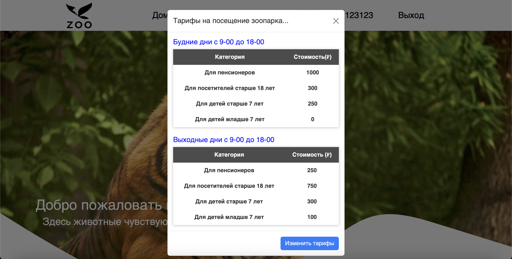

# ZOO-website

This is a website for a zoopark. Here you can find main page with hello words, tariffs that shows modal, animals page where you can get information about specifiv animal. Administratot login. Administrator can change tarrifs, animals images, animals description, names and so on.

## Table of Contents

- [Demo](#Demo)
- [Features](#Features)
- [Instalation](#Instalation)
- [Technologies Used](#Technologies-Used)

## Demo

## Features

## Instalation

To install this project, follow these steps:

1. Clone the repository: `https://github.com/pprooxyy/ZOO-website`
2. Install the dependencies: `npm install`
3. Create a `.env` file and copy the contents from `.env-example`
4. Create the database and run migrations using `sequelize-cli: npx sequelize-cli db:create && npx sequelize-cli db:migrate && npx sequelize-cli`
5. Start the server: `npm run dev`
6. Access the server at `http://localhost:3005`

## Technologies Used

This project was built with:

- Express.js
- HTML
- CSS
- JavaScript
- Postgres
- Sequelize
- React JSX Components
- Typed.js
- Numbers API
